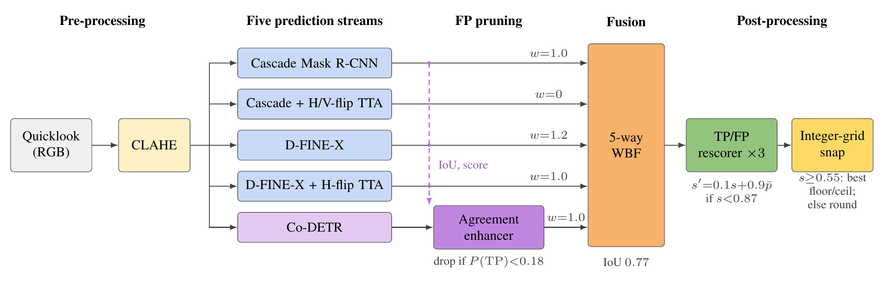
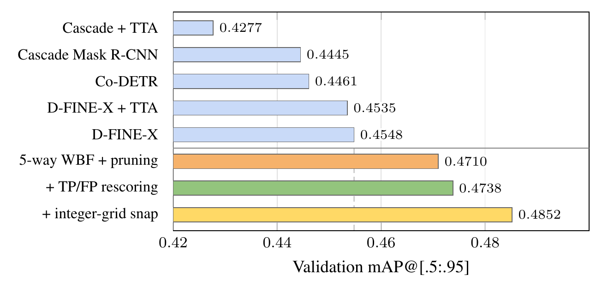

<div align="center">

# ClearSAR · Track 1 — SpaceQuokkas

### Agreement-Aware Detector Fusion for RFI Localization in SAR Quicklooks

**0.5131 mAP** on the test leaderboard · **0.4852 mAP** on our validation split



</div>

Radio-frequency interference (RFI) shows up in Sentinel-1 quicklooks as thin,
mostly horizontal stripes. The [ClearSAR challenge](https://platform-challenges.philab.esa.int/clear-sar)
asks for a bounding box around each of them.

Every detector we trained stalled near 0.45 mAP, but they failed on *different*
boxes. So instead of looking for a better detector, we built a chain that
combines three imperfect ones and uses **who agreed with whom** as a signal.

This repository contains the **inference and post-processing code** of our
final submission, our validation split, and the predictions we submitted.

> [!NOTE]
> Trained weights and model configuration files are **not** included.
> They are available on request: see [Weights](#weights).

> [!NOTE]
> Our code and comments were cleaned with an AI coding assistant
> ([Codex](https://openai.com/codex)) so the repository is easier to read
> and follow. The method, the experiments, and the submitted predictions
> are the team's. Third-party code, such as Co-DETR, was left as published.

## The idea in five steps

| # | Step | What it does |
|---|------|--------------|
| 1 | **Five prediction streams** | Cascade Mask R-CNN (Swin-L), Co-DETR (Swin-L) and D-FINE-X (HGNetv2-B5), plus flip test-time augmentation for Cascade and D-FINE. All inputs are contrast-enhanced with CLAHE. |
| 2 | **Agreement pruning** | A small crop-and-context network removes Co-DETR false positives *before* fusion, using what the other detectors say about the same region. |
| 3 | **Weighted boxes fusion** | The five streams are merged. One stream has weight zero: it adds agreement evidence without moving the boxes. |
| 4 | **TP/FP rescoring** | Three seeds of a second small network look at each fused box and at which detectors voted for it, and correct the confidence. Coordinates are untouched. |
| 5 | **Integer-grid snap** | The labels are drawn on whole pixels, so fused corners are moved onto the integer grid. |

A plain-language explanation of the rescorer is in [`docs/rescorer.md`](docs/rescorer.md).

## Results

<div align="center">

</div>

| Stage | Val. mAP@[.5:.95] | Gain |
|-------|:-----------------:|:----:|
| Best single detector (D-FINE-X) | 0.4548 | – |
| 5-way WBF + Co-DETR pruning | 0.4710 | +0.0162 |
| + TP/FP rescoring | 0.4738 | +0.0028 |
| + integer-grid snap | **0.4852** | +0.0114 |
| **Test leaderboard** | **0.5131** | |

Final submission on the validation split: AP<sub>50</sub> 0.7597 · AP<sub>75</sub> 0.5021 ·
AP<sub>S</sub> 0.4554 · AP<sub>M</sub> 0.5386 · AP<sub>L</sub> 0.3496.

## What is in the repository

```
├── inference/          detector inference (MMDetection and D-FINE), with and without TTA
│   └── projects/co_detr/   Co-DETR model code (third party, see NOTICE.md)
├── enhancers/          step 2: agreement-based pruning of Co-DETR
├── ensemble/           step 3: 5-way weighted boxes fusion with provenance
├── verifier/           step 4: TP/FP rescoring network and features
├── postprocess/        step 5: score-conditional integer-grid snap
├── tools/              COCO evaluation, submission check, image-only annotation file
├── predictions/        our final predictions (validation and test)
├── splits/             image IDs of our validation split
├── docs/               the rescorer explained in plain language
└── assets/             figures
```

## Check our numbers without running any model

The predictions we submitted are in `predictions/`. With the ClearSAR
annotations in place you can re-score the validation file directly:

```bash
pip install pycocotools
python tools/eval_val_map.py \
    --ann  data/annotations/instances_val.json \
    --pred predictions/val_final.json \
    --expected 0.4852
```

`instances_val.json` is the subset of the official training annotations whose
image IDs are listed in [`splits/val_image_ids.txt`](splits/val_image_ids.txt)
(315 images). The remaining 2839 labelled images are our training split.

## Run the full chain

You need the trained weights for this part (see [Weights](#weights)).

### Setup

```bash
pip install -r requirements.txt
```

In addition, install [MMDetection 3.x](https://github.com/open-mmlab/mmdetection)
(with MMCV and MMEngine) and clone [D-FINE](https://github.com/Peterande/D-FINE),
then point `DFINE_ROOT` to the clone.

Expected layout:

```
models/
├── checkpoints/   cascade.pth  codetr.pth  dfine.pth
│                  enhancer_codetr.pt  verifier_s42.pt  verifier_s7.pt  verifier_s123.pt
└── config/        cascade.py  codetr.py  dfine.yml
data/
├── images/{val,test}/                   image files named <image_id>.png
└── annotations/instances_{val,test}.json
```

The test set has no annotations. The later steps only need image sizes, so
create an image-only file once:

```bash
python tools/build_image_only_ann.py \
    --img-dir data/images/test --out data/annotations/instances_test.json
```

Set the variables used below (shown for the test split):

```bash
export DFINE_ROOT=/path/to/D-FINE
IMG=data/images/test
ANN=data/annotations/instances_test.json
OUT=output/test
CKPT=models/checkpoints
CFG=models/config
```

### 1 · Detectors: five prediction streams

```bash
# Cascade Mask R-CNN
python inference/run_mmdet_inference.py $CFG/cascade.py $CKPT/cascade.pth \
    --test-dir $IMG/ --output $OUT/cascade.json

# Cascade Mask R-CNN + horizontal/vertical flip TTA
python inference/run_mmdet_tta_inference.py $CFG/cascade.py $CKPT/cascade.pth \
    --test-dir $IMG/ --augs base,hflip,vflip --iou-thr 0.7 --conf-type max \
    --output $OUT/cascade_TTA.json

# Co-DETR
python inference/run_mmdet_inference.py $CFG/codetr.py $CKPT/codetr.pth \
    --test-dir $IMG/ --output $OUT/codetr.json

# D-FINE-X
python inference/run_dfine_inference.py $CKPT/dfine.pth --config $CFG/dfine.yml \
    --test-dir $IMG/ --apply-clahe --input-size 1024 --threshold 0.001 \
    --output $OUT/dfine.json

# D-FINE-X + horizontal flip TTA
python inference/run_dfine_tta_inference.py $CKPT/dfine.pth --config $CFG/dfine.yml \
    --test-dir $IMG/ --apply-clahe --augs '1024,1024_hflip' --iou-thr 0.7 --conf-type max \
    --output $OUT/dfine_TTA.json
```

### 2 · Prune Co-DETR with cross-detector agreement

```bash
python enhancers/prune_codetr.py \
    --ckpt $CKPT/enhancer_codetr.pt \
    --codetr-preds    $OUT/codetr.json \
    --cascade-preds   $OUT/cascade.json \
    --dfine-preds     $OUT/dfine.json \
    --dfine-tta-preds $OUT/dfine_TTA.json \
    --img-dir $IMG/ --ann $ANN \
    --threshold 0.18 \
    --out $OUT/codetr_pruned.json
```

### 3 · Fuse the five streams

```bash
python ensemble/model_ensemble.py \
    --pred-cascade     $OUT/cascade.json \
    --pred-cascade-tta $OUT/cascade_TTA.json \
    --pred-co-detr     $OUT/codetr_pruned.json \
    --pred-dfine       $OUT/dfine.json \
    --pred-dfine-tta   $OUT/dfine_TTA.json \
    --ann $ANN \
    --thr-cascade 0.18 --thr-cascade-tta 0.10 --thr-co-detr 0.06 \
    --thr-dfine 0.28 --thr-dfine-tta 0.28 \
    --w-cascade 1.0 --w-cascade-tta 0.0 --w-co-detr 1.0 \
    --w-dfine 1.2 --w-dfine-tta 1.0 \
    --iou 0.77 --match-iou 0.55 \
    --out $OUT/fused_wbf.json
```

### 4 · Rescore the fused boxes

```bash
python verifier/verifier_rescore.py \
    --ckpt $CKPT/verifier_s42.pt,$CKPT/verifier_s7.pt,$CKPT/verifier_s123.pt \
    --fused-preds $OUT/fused_wbf.json \
    --ann $ANN --img-dir $IMG/ \
    --mode blend_band --cap 0.87 --w 0.90 \
    --out $OUT/fused_wbf_rescored.json
```

### 5 · Snap to the integer grid

```bash
python postprocess/snap_score_split.py \
    --in $OUT/fused_wbf_rescored.json \
    --out submission/final.json --T 0.55 --zip
```

### Check the result

```bash
# test split: byte-for-byte comparison with the file we submitted
python tools/verify_submission.py --candidate submission/final.json

# validation split: run steps 1-5 with the val paths, then
python tools/eval_val_map.py --ann data/annotations/instances_val.json \
    --pred submission/val_final.json --expected 0.4852
```

The whole chain takes about 27 minutes for the validation and test splits
together (1101 images) on a single consumer GPU.

> [!TIP]
> A byte-identical test file requires the software stack we used
> (`torch==2.11.0+cu130`, `torchvision==0.26.0+cu130`). Other versions give
> the same mAP to within about 0.001 but a different file hash, because tiny
> numerical differences propagate through fusion, rescoring and snapping.

## Settings at a glance

| Stream | Min. score | Fusion weight |
|--------|:----------:|:-------------:|
| Cascade Mask R-CNN | 0.18 | 1.0 |
| Cascade + H/V-flip TTA | 0.10 | 0.0 |
| Co-DETR (after pruning at P(TP) < 0.18) | 0.06 | 1.0 |
| D-FINE-X | 0.28 | 1.2 |
| D-FINE-X + H-flip TTA | 0.28 | 1.0 |

Fusion IoU 0.77 · rescoring `s' = 0.1·s + 0.9·p` for `s < 0.87` · snapping threshold 0.55 ·
CLAHE clip limit 4, 8×8 tiles.

## Weights

The trained checkpoints (three detectors, the pruning network and the three
rescorer seeds) and their configuration files are not distributed with this
repository. If you need them for research, write to
**m.ortiz@totia.es** and tell us what you plan to do with them.

## Team

**SpaceQuokkas** — Miguel Ortiz del Castillo, Laura López Fuentes,
Juan Jiménez Recaredo, Francesc Pérez Pastor and Adrián Tobar Nicolau.

TotIA · University of the Balearic Islands · The University of Melbourne

## Citation

If this work is useful to you, please cite our ICIP 2026 extended abstract:

```bibtex
@inproceedings{delcastillo2026cross,
  author    = {del Castillo, Miguel Ortiz and Fuentes, Laura Lopez and Pastor, Francesc Perez and Recaredo, Juan Jimenez and Nicolau, Adrian Tobar},
  title     = {Cross-Detector Enhanced Ensemble: A Solution for the ClearSAR RFI Detection Challenge},
  booktitle = {Proceedings of the 2026 IEEE International Conference on Image Processing (ICIP)},
  year      = {2026},
  address   = {Tampere, Finland},
  publisher = {IEEE},
  note      = {Extended Abstract (ClearSAR Grand Challenge)}
}
```

## Acknowledgments

Built on [MMDetection](https://github.com/open-mmlab/mmdetection),
[Co-DETR](https://github.com/Sense-X/Co-DETR),
[D-FINE](https://github.com/Peterande/D-FINE) and
[Weighted Boxes Fusion](https://github.com/ZFTurbo/Weighted-Boxes-Fusion).
The Co-DETR model code in `inference/projects/co_detr/` is third-party code
under the Apache License 2.0; see the `NOTICE.md` in that folder.

Thanks to the ClearSAR organizers for the dataset and the challenge.
